<p align="center">
  
</p>

<p align="center">
  <a href="https://github.com/shyamraj2143"></a>
  
  
</p>

<h2 align="center">⚡ Building practical software with AI, full-stack engineering & realtime systems.</h2>

<p align="center">B.Tech Computer Science & Engineering student focused on turning ideas into usable products.</p>

---

## 🧑‍💻 Developer Snapshot

<table>
<tr>
<td width="33%" valign="top">

### 🤖 AI Applications

Multi-model AI integration, document intelligence, voice, vision and user-controlled memory.

</td>
<td width="33%" valign="top">

### ⚙️ Full-Stack

Python/FastAPI backends with React, TypeScript, REST APIs, databases and production workflows.

</td>
<td width="33%" valign="top">

### 📡 Realtime

WebRTC, Socket.IO, Redis, Firebase notifications and Android communication workflows.

</td>
</tr>
</table>

## 🧠 About Me

- 🎓 B.Tech Computer Science & Engineering student at **I.K. Gujral Punjab Technical University**
- 🚀 Building **Auto AI**, a multi-model AI and realtime communication platform
- 📱 Working across web, backend and Android-oriented systems
- 🧩 Interested in AI application engineering, backend architecture and realtime systems
- 🤝 Open to software engineering internships and technical collaborations

## 🛠️ Technology Stack

<p align="center">
  
</p>

| Focus | Technologies |
|---|---|
| **AI** | OpenAI · Groq · Amazon Bedrock · AI API integration · model orchestration |
| **Backend** | Python · FastAPI · Node.js · Express · REST APIs · SQLAlchemy |
| **Frontend** | React · TypeScript · JavaScript · Tailwind CSS |
| **Realtime** | WebRTC · Socket.IO · Redis · Firebase Cloud Messaging |
| **Mobile** | Android · React Native · Firebase |
| **Data & DevOps** | MongoDB · PostgreSQL · SQLite · Docker · GitHub Actions |

## 🚀 Project Showcase

<table>
<tr>
<td width="50%" valign="top">

### 🧠 Auto AI

Multi-model AI assistant combining chat, documents, voice, vision, memory and realtime audio/video communication.

**Python · FastAPI · React · TypeScript · WebRTC · Redis · Firebase · AI APIs**

<a href="https://github.com/shyamraj2143/auto-ai">→ Explore Auto AI</a>

</td>
<td width="50%" valign="top">

### 📡 VideoApp

Realtime communication platform spanning backend, mobile application, messaging, notifications and call workflows.

**Node.js · Express · MongoDB · Socket.IO · React Native · Docker**

<a href="https://github.com/shyamraj2143/whatsapp">→ Explore VideoApp</a>

</td>
</tr>
<tr>
<td width="50%" valign="top">

### 📊 Clean Metric Summary Viewer

Academic team project focused on planning data validation, cleaning, deduplication, classification and summary dashboards for CSV/TXT/LOG data.

**FastAPI · Pandas · Data Quality · System Design**

</td>
<td width="50%" valign="top">

### 🎬 VideoServer

Lightweight Python local video streaming server with browser uploads, search and folder switching.

**Python · HTTP Streaming · Local Storage**

<a href="https://github.com/shyamraj2143/videoserver">→ Explore VideoServer</a>

</td>
</tr>
</table>

## 📈 GitHub Activity

<p align="center">
  
  
</p>

<p align="center">
  
</p>

<p align="center">
  
</p>

## 🎯 What I'm Building Toward

```text
AI Applications
      ↓
Reliable Backend Systems
      ↓
Realtime + Mobile Experiences
      ↓
Production-ready Engineering
      ↓
Real-world Products
```

## 📚 Currently Strengthening

`Backend Architecture` · `AI Application Engineering` · `System Design` · `Realtime Communication` · `Cloud Deployment` · `Data Structures & Algorithms`

## 💼 Open To

**Software Engineering Internships · Backend Internships · Full-Stack Internships · AI Application Internships · Technical Collaborations**

## 📫 Connect

<p align="center">
  <a href="https://www.linkedin.com/in/shyam-raj-438558331/"></a>
  <a href="https://github.com/shyamraj2143"></a>
</p>

---

<p align="center"><strong>Build it. Understand it. Improve it. Ship it.</strong></p>
<p align="center"><sub>AI • Full-Stack • Realtime • Android • Product Engineering</sub></p>
